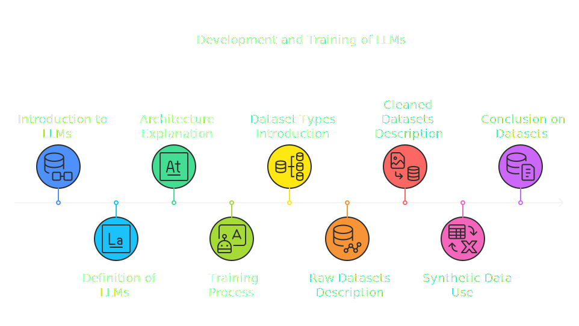
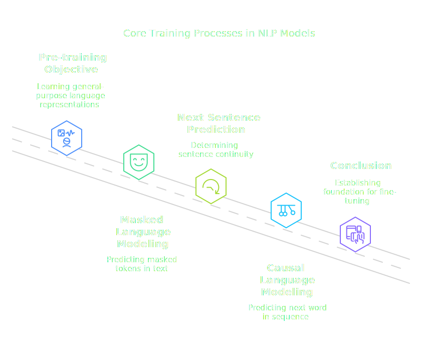
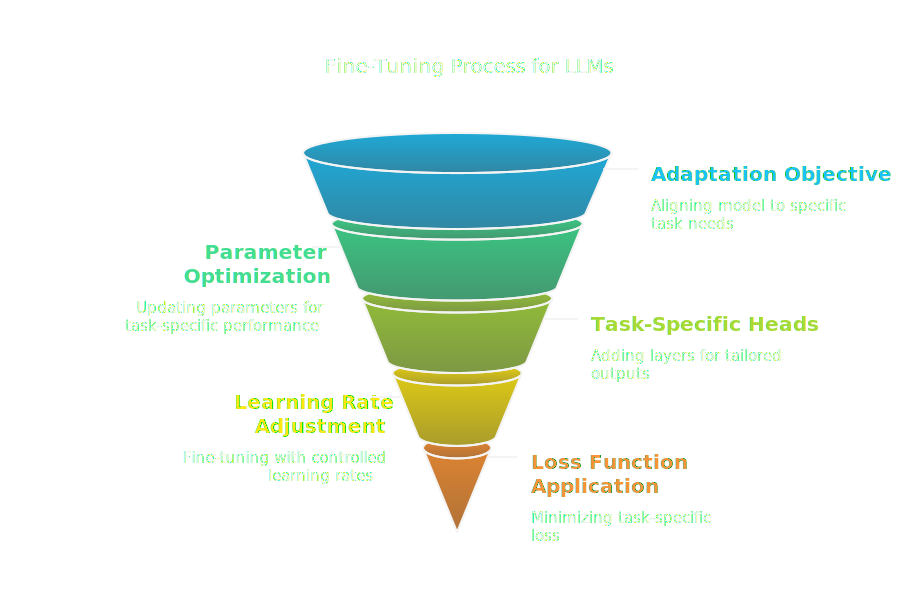
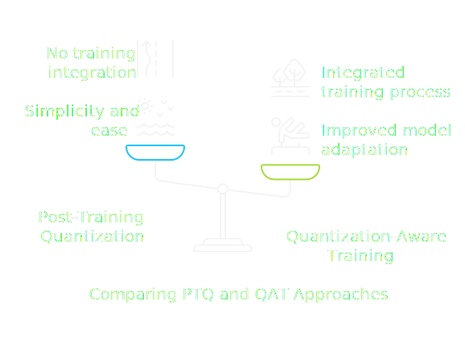
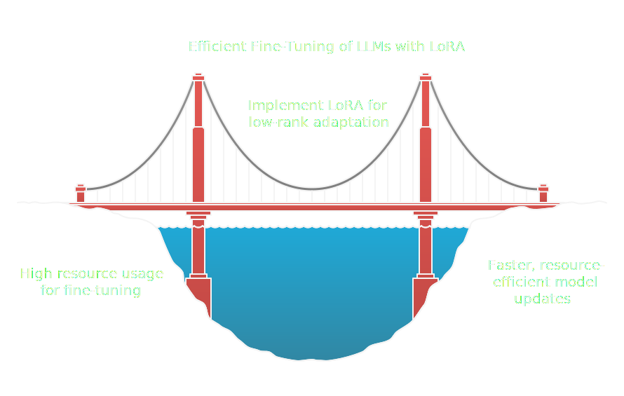
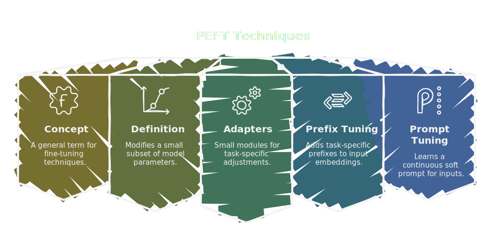
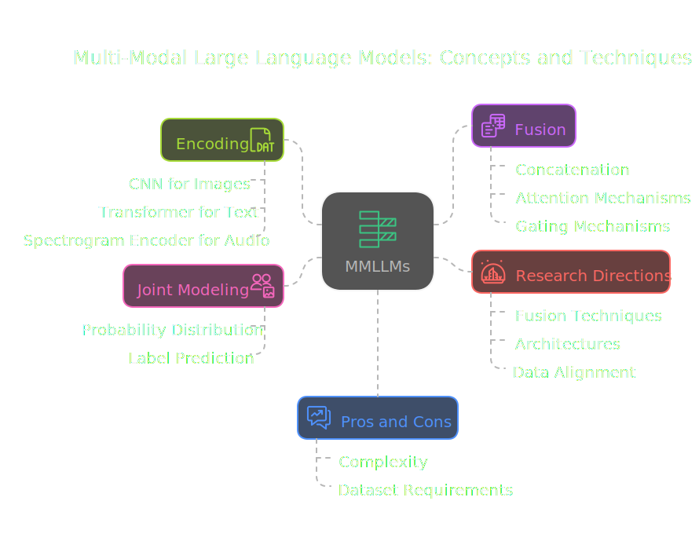
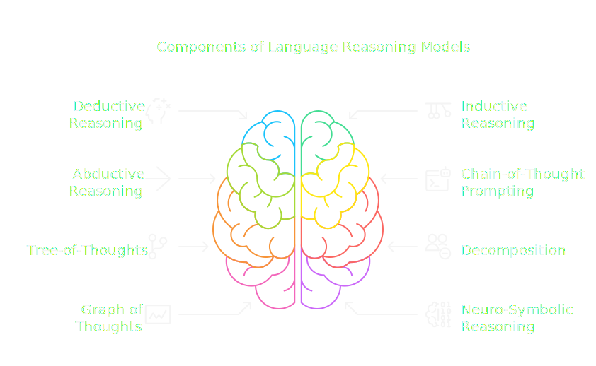
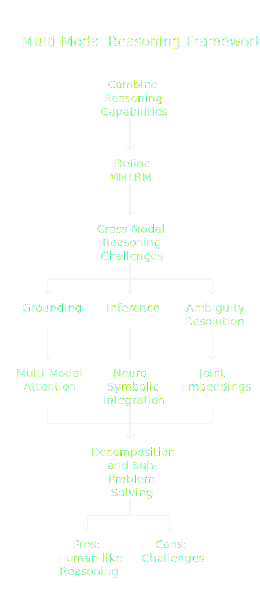

# Decoding Language AI: A Technical Journey Through LLMs, LRMs, and MMLLMs

### Comprehensive Guide to LLMs: From Basic to Advanced Concepts

#### Chapter 1: Foundations of LLMs and Dataset Essentials

- **1.  1 Introduction to LLMs and Dataset Types**
    - **1.  1.1 Concept (Objective):**
        Large Language Models (LLMs) are a class of deep learning models designed to understand, generate, and manipulate human language.  They are trained on massive datasets of text and (increasingly) other modalities. The core objective is to learn a probability distribution over sequences of words (or tokens).  This distribution allows the model to predict the next word in a sequence, given the preceding words.

    - **1.  1.2 Definition:**
        An LLM can be formally defined as a parameterized function  $ f_{\theta}: \mathcal{V}^* \rightarrow [0, 1] $, where:
         *  $ \mathcal{V} $ is the vocabulary (the set of all possible words/tokens).
         *  $ \mathcal{V}^* $ is the set of all finite sequences of words from the vocabulary (including the empty sequence).
         *  $ \theta $ represents the parameters of the model (weights and biases of the neural network).
         *  For a sequence $ w = (w_1, w_2, ..., w_n) \in \mathcal{V}^* $,  $ f_{\theta}(w) $ approximates the probability  $ P(w_n | w_1, w_2, ..., w_{n-1}) $, the probability of the *n*-th word given the preceding words.  This is often simplified by the Markov assumption (limited context window).

    - **1.  1.3 Details of the Concept:**
      - **Architecture:**  Most LLMs are based on the Transformer architecture, which utilizes self-attention mechanisms.  Self-attention allows the model to weigh the importance of different words in the input sequence when predicting the next word. Mathematically, the self-attention mechanism can be expressed as:

        $$ \text{Attention}(Q, K, V) = \text{softmax}\left(\frac{QK^T}{\sqrt{d_k}}\right)V $$

        Where:
        *   $Q$ (Query), $K$ (Key), and $V$ (Value) are matrices derived from the input sequence.  They are linear transformations of the input embeddings:  $Q = XW_Q$, $K = XW_K$, $V = XW_V$, where $X$ is the input embedding matrix and $W_Q$, $W_K$, $W_V$ are learned weight matrices.
        *   $d_k$ is the dimension of the keys (and queries).  The division by  $ \sqrt{d_k} $ is a scaling factor to prevent the dot products from becoming too large, which can lead to instability during training (gradients vanish).
        *   The softmax function normalizes the attention weights to sum to 1.

      - **Training:** LLMs are typically trained using a maximum likelihood estimation (MLE) objective.  Given a training dataset  $ \mathcal{D} = \{w^{(1)}, w^{(2)}, ..., w^{(M)}\} $ of word sequences, the objective is to maximize the log-likelihood of the data:

        $$ \mathcal{L}(\theta) = \sum_{i=1}^{M} \log P(w^{(i)} ; \theta) = \sum_{i=1}^{M} \sum_{t=1}^{n_i} \log P(w_t^{(i)} | w_1^{(i)}, ..., w_{t-1}^{(i)} ; \theta) $$

        Where $ n_i $ is the length of the *i*-th sequence. This is typically optimized using stochastic gradient descent (SGD) or variants like Adam.

    - **1.1.  4 Conclusion (Pros, Cons, Research Improvement):**
        - **Pros:** LLMs can capture complex linguistic patterns, generate coherent text, and perform a wide range of NLP tasks.
        - **Cons:**  Require massive datasets and computational resources, can be prone to biases present in the training data, and may generate factually incorrect or nonsensical output.
        - **Research Improvement:** Focus areas include improving data efficiency, reducing bias, enhancing factual accuracy, and developing better evaluation metrics.

    - **1.2 Dataset Types**
        - **1.2.1 Raw Datasets:**  These are the initial, unrefined collections of text data, often scraped from the web (e.g., Common Crawl), books (e.g., BookCorpus), or other sources. They contain noise, inconsistencies, and may not be representative of the desired distribution for a specific task.
                - **Definition;** Raw data can be defined as a collection of samples,
                   $$ \mathcal{R} = \Big\{ x_i| x_i \in \mathcal{X} \Big\}_{i=1}^N $$
                  where,
                       $R$: collection of raw data
                                           $X$: Sample data point
                                           $X$: domain,
                                           $N$:number of sample in domain

        - **1.2.2 Cleaned Datasets:** Raw datasets are preprocessed to remove noise, errors, and inconsistencies. This typically involves steps like:
            -   **Deduplication:** Removing duplicate documents or sentences.
            -   **Filtering:** Removing unwanted content (e.g., HTML tags, non-English text).
            -   **Normalization:**  Converting text to a consistent format (e.g., lowercase, handling special characters).
            - **Tokenization**: splitting texts into,
              $$ T = \Big\{ t_1,t_2, \dots ,t_n   \Big\} $$
        - **1.2.3 Synthetic Data:** Artificially generated data used to augment the training dataset. This can be useful for:
            -   **Data Augmentation:**  Creating variations of existing examples to increase the diversity of the training data.  For example, back-translation (translating text to another language and then back to the original language) can generate paraphrases.
            -   **Addressing Data Scarcity:** Generating examples for rare cases or underrepresented classes.
            -   **Bias Mitigation:**  Creating synthetic data to balance the representation of different demographic groups.
             - **Definition;**:
                            Based on the original data distribution $ p(x) $, the process creates new data samples $(x')$ following the,
                                $$ \hat{P(x)} \approx   P(x^{'})  $$
                                $$ P(x) \sim P(x^{'}) + \eta     $$
              where; $( \eta )$ is a small perturbation.

        - **1.2.4 Conclusion (Technical - Pros, Cons, Research Improvement):**
            - **Pros (Cleaned Datasets):**  Improved model performance, reduced training time, lower risk of overfitting to noise.
            - **Cons (Cleaned Datasets):**  Preprocessing can be time-consuming and may inadvertently remove valuable information.
            - **Pros (Synthetic Data):**  Can address data scarcity and bias, improve model robustness.
            - **Cons (Synthetic Data):**  May not accurately reflect the real-world data distribution, can introduce new biases if not carefully generated.
            - **Research Improvement:**  Developing automated data cleaning techniques, generating high-quality synthetic data that closely matches the real-world distribution, and creating methods for evaluating the quality of both cleaned and synthetic data.

#### Chapter 2: LLM Training and Optimization Techniques

- **2.  1 Core Training Processes**

    - **2.1.  1 Pre-training:**
        - **Concept (Objective):**  To learn a general-purpose language representation from a massive, unlabeled text corpus. The model learns to predict masked words (masked language modeling - MLM) or the next word in a sequence.
        - **Definition:** Pre-training involves optimizing the model parameters  $ \theta $ to minimize a loss function (e.g., cross-entropy loss) over a large, unlabeled dataset $ \mathcal{D} $.
        - **Details:**
          - **Masked Language Modeling (MLM):** A percentage of the input tokens are randomly masked, and the model is trained to predict the original tokens.  This is the approach used in BERT.
          - **Next Sentence Prediction (NSP):**  The model is trained to predict whether two given sentences are consecutive in the original text. This task is used in conjunction with MLM in BERT.  However, its effectiveness has been questioned in later work.
          - **Causal Language Modeling (CLM):** The model is trained to predict the next word in a sequence, given the preceding words, without any masking. This is the approach used in GPT models.

            Mathematically, CLM objective is

        $$ \mathcal{L}_{CLM}(\theta) = - \sum_{i=1}^{M} \sum_{t=1}^{n_i} \log P(w_t^{(i)} | w_1^{(i)}, ..., w_{t-1}^{(i)} ; \theta) $$
        Where $M$ is the total number of sequences, $n_i$ lengh of text, $w_t$ word of the sequence.

        - **Conclusion:** Pre-training provides a strong foundation for fine-tuning on downstream tasks.
    

    - **2.1.  2 Fine-tuning:**
        - **Concept (Objective):**  To adapt a pre-trained LLM to a specific task or dataset. The model's parameters are updated using a smaller, labeled dataset relevant to the target task.
        - **Definition:** Fine-tuning involves optimizing the pre-trained parameters  $ \theta $ (or a subset thereof) to minimize a task-specific loss function (e.g., cross-entropy for classification, mean squared error for regression) over a labeled dataset  $ \mathcal{D}_{task} $.
        - **Details:**
            -   **Task-Specific Heads:**  Additional layers (e.g., a linear classifier) are often added on top of the pre-trained model to produce task-specific outputs.
            -   **Learning Rate:** A smaller learning rate is typically used during fine-tuning compared to pre-training to avoid catastrophic forgetting (overwriting the knowledge learned during pre-training).  A common strategy is to use a learning rate scheduler that gradually decreases the learning rate over time.
            - **Loss functions of fined-tuned**
              $$ J(\theta) = - \frac{1}{N} \sum_{i=1}^{N} y^{(i)} \log(\hat{y}^{(i)}) + (1 - y^{(i)}) \log(1 - \hat{y}^{(i)}) $$
          Where $y$ is actual value, $\hat{y}$ predicted output , with help of activation like sigmoid.

        - **Conclusion:** Fine-tuning allows LLMs to achieve high performance on specific tasks.
        

- **2.  2 Advanced Optimization Strategies**

    - **2.2.  1 Quantization:**
        - **Concept (Objective):** To reduce the memory footprint and computational cost of LLMs by representing the model's weights and activations with fewer bits.
        - **Definition:** Quantization involves mapping the continuous values of weights and activations to a discrete set of values.  For example, 32-bit floating-point numbers (FP32) can be quantized to 8-bit integers (INT8).
               $$  w_q = \text{round}\left( \frac{w_f}{S} \right) + Z $$

           Where,
              *   $ w_q $ is the quantized weight.
              *   $ w_f $ is the original floating-point weight.
              *  $S$ is the scaling factor (a real number).
              * $ Z $ is the zero-point (an integer).

        - **Details:**
            -   **Post-Training Quantization (PTQ):**  Quantization is applied after the model has been trained.
            -   **Quantization-Aware Training (QAT):** Quantization is incorporated into the training process, allowing the model to adapt to the reduced precision.
            -   **Techniques:** Various methods exist, including uniform quantization, non-uniform quantization, and mixed-precision quantization.

        - **Conclusion (Technical Pros, Cons, Research):**
            - **Pros:**  Reduced memory usage, faster inference, lower power consumption.
            - **Cons:**  Can lead to a decrease in accuracy if not done carefully.
            - **Research:** Developing more sophisticated quantization techniques that minimize accuracy loss, and exploring hardware support for quantized operations.
        

    - **2.2.  2 LoRA (Low-Rank Adaptation):**
        - **Concept (Objective):**  To fine-tune LLMs efficiently by updating only a small number of parameters.  LoRA introduces low-rank matrices that are added to the pre-trained weights.
        - **Definition:**  Let  $ W_0 \in \mathbb{R}^{d \times k} $ be a pre-trained weight matrix.  LoRA updates  $ W_0 $ by adding a low-rank decomposition:

          $$ W = W_0 + \Delta W = W_0 + BA $$

            Where:
             *   $ B \in \mathbb{R}^{d \times r} $ and  $ A \in \mathbb{R}^{r \times k} $ are trainable low-rank matrices, and  $ r \ll \min(d, k) $ is the rank.  Only  $A$ and $B$ are updated during fine-tuning.

        - **Details:**  LoRA significantly reduces the number of trainable parameters, making fine-tuning faster and less memory-intensive.
        - **Conclusion:**  LoRA is an effective technique for efficient fine-tuning, especially for large models.
        

    - **2.2.  3 PEFT (Parameter-Efficient Fine-Tuning):**
        - **Concept (Objective):** A general term encompassing techniques that aim to fine-tune LLMs with minimal parameter updates. This includes LoRA, adapters, prefix tuning, and other methods.
        - **Definition:**  PEFT methods modify only a small subset of the model's parameters or add a small number of new parameters during fine-tuning.
        - **Details:**
            -   **Adapters:** Small, task-specific modules inserted between layers of the pre-trained model.
            -   **Prefix Tuning:**  Adding trainable, task-specific prefixes to the input embeddings.
            -   **Prompt Tuning:** Learning a continuous "soft prompt" that is prepended to the input.
        - **Conclusion:**  PEFT methods enable efficient adaptation of LLMs to new tasks while preserving most of the pre-trained knowledge.
        

#### Chapter 3: Multi-Modal LLMs (MMLLMs)

- **3.  1 Introduction to Multi-Modal LLMs**

    - **3.1.  1 Concept (Objective):** To extend the capabilities of LLMs beyond text to handle multiple modalities, such as images, audio, and video. The goal is to learn a joint representation that captures the relationships between different modalities.
    - **3.1.  2 Definition:** An MMLLM is a model  $ f_{\theta}: (\mathcal{M}_1^*, \mathcal{M}_2^*, ..., \mathcal{M}_k^*) \rightarrow [0, 1] $  that takes as input sequences from multiple modalities  $ \mathcal{M}_1, \mathcal{M}_2, ..., \mathcal{M}_k $ (e.g., text, image, audio) and learns a joint probability distribution.
    - **3.1.  3 Details:**
        -   **Encoding:** Each modality is typically processed by a separate encoder (e.g., a CNN for images, a Transformer for text, a spectrogram encoder for audio).
        -   **Fusion:** The encoded representations from different modalities are fused together using techniques like:
            -   **Concatenation:** Simply concatenating the representations.
            -   **Attention Mechanisms:** Applying attention across modalities to learn their relationships.  Cross-modal attention allows the model to attend to relevant parts of different modalities.
            -   **Gating Mechanisms:** Using gating mechanisms to control the flow of information between modalities.
        -  **Joint Modeling**
        $$  \mathcal{L}_{joint} = -\sum_{i=1}^N \log P(y_i | x_{i,text}, x_{i,image}, x_{i,audio}) $$
        Where,
        *  $x_{i,text}$, $x_{i,image}$, and $x_{i,audio}$ are the text, image, and audio inputs for the *i*-th example, respectively.
        *   $y_i$ is the corresponding label or target output.
    - **3.1.  4 Conclusion (Technical Pros, Cons, Research):**
        - **Pros:** Can perform tasks that require understanding multiple modalities (e.g., image captioning, visual question answering), leading to richer and more human-like AI systems.
        - **Cons:**  More complex to train and require larger datasets with aligned data across modalities.
        - **Research:**  Developing better fusion techniques, exploring different architectures for multi-modal learning, and addressing the challenges of data alignment and cross-modal transfer learning.
     
#### Chapter 4: Large Reasoning Models (LRMs)

- **4.  1 Understanding LRMs** 
    - **4.1. 1 Concept (Objective):** To go beyond pattern recognition and develop models capable of complex reasoning, planning, and problem-solving. LRMs aim to emulate human-like reasoning abilities.
    - **4.1. 2 Definition:** An LRM is a model designed to infer relationships, draw     conclusions, make predictions, and solve problems based on provided information     and learned knowledge. While often language-based, the focus is on the reasoning     process itself.

    - **4.1.  3 Details:** 
        -   **Reasoning (Types):**
            -   **Deductive Reasoning:** Drawing logically certain conclusions from given premises.  Example: "All men are mortal. Socrates is a man. Therefore, Socrates is mortal."  This can be formalized using logical rules and inference mechanisms.
            -   **Inductive Reasoning:** Generalizing from specific observations to broader conclusions. Example: "Every swan I have ever seen is white. Therefore, all swans are white." (This is famously false, demonstrating the potential for incorrect inductive inferences).  Probabilistic models are often used to represent inductive reasoning.
            -   **Abductive Reasoning:**  Inferring the most likely explanation for a set of observations.  Example: "The grass is wet. It probably rained."  This involves reasoning to the best explanation, often using Bayesian inference. Mathematically, given evidence *E* and hypotheses *H*, abductive reasoning seeks to find the hypothesis *h* that maximizes:

                $$ P(h|E) = \frac{P(E|h)P(h)}{P(E)} $$

                Where $P(h|E)$ is the posterior probability of the hypothesis given the evidence, $P(E|h)$ is the likelihood of the evidence given the hypothesis, $P(h)$ is the prior probability of the hypothesis, and $P(E)$ is the probability of the evidence.

        -   **Techniques:**
            -   **Chain-of-Thought (CoT) Prompting:**  Encouraging LLMs to generate intermediate reasoning steps before producing a final answer.  This improves performance on complex reasoning tasks.  CoT prompting can be seen as explicitly guiding the model through a reasoning process.
            -   **Tree-of-Thoughts (ToT):** building a tree of reasoning.
                -   **Decomposition:** Break down a complex problem into smaller, more manageable subproblems.
                -   **Evaluation:** Evaluate the potential solutions to each subproblem.
                -   **Search:** Explore the space of possible solutions using search algorithms (e.g., breadth-first search, depth-first search, Monte Carlo Tree Search).
            - **Graph of Thoughts (GoT):** transform information into a graph structure
            -   **Neuro-Symbolic Reasoning:** Combining neural networks with symbolic reasoning systems.  Neural networks excel at pattern recognition, while symbolic systems are better at logical reasoning and knowledge representation.  The challenge is to integrate these two approaches effectively.  For example, a neural network might be used to extract entities and relationships from text, which are then represented as a knowledge graph.  Symbolic reasoning rules can then be applied to the knowledge graph to derive new conclusions.
            -   **External Knowledge Integration:**  Incorporating external knowledge sources (e.g., knowledge bases, databases) into the reasoning process.
        

    -   **4.1.4 Conclusion (Technical Pros, Cons, Research):**
        -   **Pros:** Potential for more robust and reliable decision-making, ability to handle complex and nuanced situations.
        -   **Cons:**  Current LRMs are still limited in their reasoning abilities, often struggle with common sense reasoning, and can be brittle and easily fooled.
        -   **Research:**  Developing more powerful reasoning mechanisms, integrating common sense knowledge, improving robustness, and creating better evaluation benchmarks for reasoning abilities.

- **4.  2 Multi-Modal LRMs (MMLRMs)**

    - **4.2.  1 Concept (Objective):**  To combine the reasoning capabilities of LRMs with the multi-modal understanding of MMLLMs.  This allows for reasoning over information from multiple sources (text, images, audio, video).
    - **4.2.  2 Definition:**  An MMLRM takes multi-modal input and performs reasoning tasks that require integrating and interpreting information from different modalities.  It extends the LRM framework to handle heterogeneous data.
    - **4.2.  3 Details:**
        -   **Cross-Modal Reasoning Challenges:**
            -   **Grounding:**  Connecting concepts and entities across modalities (e.g., linking the word "cat" in a text description to the image of a cat).
            -   **Inference:**  Drawing conclusions that require combining information from different modalities (e.g., inferring the action taking place in a video based on visual and audio cues).
            -   **Ambiguity Resolution:**  Resolving ambiguities that arise from combining different modalities (e.g., a visually ambiguous object might be clarified by accompanying text).
        -    cross-model inputs x, $x \in {X_{text}, X_{images} , X_{video}, X_{audio} }$
          -    fined-tuned models
        - **Techniques of reasoning**
            -   **Multi-Modal Attention:** Extending attention mechanisms to operate across modalities, allowing the model to focus on relevant information from each modality.
            -   **Neuro-Symbolic Integration (Multi-Modal):** Combining neural networks with symbolic representations for multi-modal reasoning. For example, visual information might be represented as a scene graph, which is then combined with textual information and logical rules.
            -   **Joint Embeddings:** Learning a joint embedding space where representations from different modalities are close if they represent the same concept or entity.
             -  **reasoning framework**
                 -  **Decomposition and Sub-Problem Solving:**  Breaking down a multi-modal reasoning task into subproblems that can be addressed by individual modalities or by combining modalities.

    - **4.2.  4 Conclusion (Technical Pros, Cons, Research):**
        -   **Pros:**  Enables more human-like reasoning in complex, real-world scenarios, can handle a wider range of tasks.
        -   **Cons:**  Significant challenges in data alignment, cross-modal reasoning, and computational complexity.
        -   **Research:**  Developing robust cross-modal grounding techniques, improving inference across modalities, creating large-scale multi-modal reasoning datasets, and designing efficient architectures for MMLRMs.
    

#### Chapter 5: Unified Framework for LLMs, LRMs, MMLLMs, and MMLRMs

- **5.1 Integration of Models and Techniques**
  - **5.1.1.**  **Concept:** To create a cohesive AI system that leverages the strengths of each model type and optimization technique.
  - **5.1.2.** **Definition:** A unified framework combines the functionalities of LLMs (language understanding and generation), LRMs (reasoning), MMLLMs (multi-modal understanding), and MMLRMs (multi-modal reasoning) into a single, integrated system.  This may involve modular design, shared components, and common optimization strategies.

  - **5.1.3.** **Details:**
    -  **Modular Architecture:**  Designing the system with separate modules for each model type, allowing for independent development and improvement.  Modules can communicate through well-defined interfaces.
    -  **Shared Representations:**  Using a shared embedding space for different modalities and model types, facilitating transfer learning and cross-modal reasoning.  This can reduce redundancy and improve efficiency.
    -  **Unified Optimization:** Applying optimization techniques (quantization, fine-tuning, LoRA, PEFT) across the entire system, rather than to individual models.  This ensures consistency and allows for end-to-end optimization.
     - **Orchestration:** A central controller or orchestrator manages the interaction between different models.  For example, the orchestrator might decide when to call upon the LRM for complex reasoning or the MMLLM for multi-modal input.
     -  **Pipeline:**
         -   **Input Processing:**  The system receives input in various modalities (text, image, audio, video).  Each modality is processed by its respective encoder (e.g., a text encoder for text, an image encoder for images).
         -   **Multi-Modal Fusion:** The encoded representations are fused together (e.g., using multi-modal attention).
         -   **Reasoning:**  The LRM (or MMLRM) component performs reasoning based on the fused representation and external knowledge (if available).
         -   **Output Generation:** The LLM component generates the final output (e.g., text, code, actions).
         -   **Feedback Loop:** The system may incorporate a feedback loop, allowing it to learn from its mistakes and improve its performance over time.
     - **Example Scenario: A Smart Assistant**
         1.  **User Input:** A user asks a question verbally ("What's the weather like in London?") and shows a picture of a specific location in London.
         2.  **Input Processing:**
             -   The audio of the question is transcribed to text by a speech-to-text module.
             -   The text is processed by the LLM's text encoder.
             -   The image is processed by the MMLLM's image encoder.
         3.  **Multi-Modal Fusion:** The text and image representations are fused together.
         4.  **Reasoning:** The LRM (or MMLRM) component:
             -   Identifies the user's intent (to get weather information).
             -   Determines the location (London, and the specific location within London from the image).
             -   Queries an external weather API.
         5.  **Output Generation:** The LLM component generates a response: "The weather in London at [specific location from image] is currently [weather conditions from API]."

- **5.2 Applying Techniques Across Merged Models**
    - **5.2.1. Concept (Objective)**. Same as in sections 2.2.
    - **5.2.2. Definition**. Same as in sections 2.2.

    Details of each technique, Quantization, Fine-Tuning, Pre-training, Lora, and PEFT, have been defined thoroughly in Section 2.2. The same core mathematical and technical principles apply when used within a merged model context. The main difference is the *scope* of application:

    - **Quantization (Merged Models):** Can be applied to the entire merged model or selectively to specific modules (e.g., only the LLM component).
    - **Fine-Tuning (Merged Models):** Fine-tuning can be performed on the entire system or on specific modules, depending on the task. End-to-end fine-tuning is often desirable but can be computationally expensive.
    - **Pre-training (Merged Models):**  Pre-training can be used to initialize the weights of the different modules before they are integrated. For a new merged model, staged pre-training could be considered (first pre-train individual components, then pre-train the fused representation).
    - **LoRA & PEFT (Merged Models):**  These techniques are particularly valuable for large merged models, as they allow for efficient adaptation to new tasks without updating all parameters. They can be applied to individual modules or across multiple modules.

#### Chapter 6: Pathways to Advanced AI Systems

-   **6.1 Steps Toward Artificial General Intelligence (AGI)**

    -   **6.1.1 Concept (Objective):**  To create AI systems with human-level cognitive abilities, capable of performing any intellectual task that a human being can.
    -   **6.1.2 Definition:**  AGI is characterized by its generality and adaptability.  Unlike narrow AI, which is designed for specific tasks, AGI should be able to learn and perform a wide range of tasks without being explicitly programmed for them.
    -   **6.1.3 Key Milestones and Challenges:**
        -   **Continual Learning:** The ability to learn continuously from new experiences and adapt to changing environments, without forgetting previously learned knowledge.  This is crucial for AGI to operate in the real world.
        -   **Common Sense Reasoning:**  Possessing and applying common sense knowledge about the world, which is often implicit and difficult to formalize.
        -   **Transfer Learning:**  Applying knowledge learned in one context to new, different contexts.  This requires abstracting away from specific details and identifying underlying principles.
        -   **Causal Reasoning:** Understanding cause-and-effect relationships, which is essential for planning and decision-making.  Current ML models are often good at correlation but struggle with causation.
        - **Meta learninig.** AGI should Ideally be able to learn, adapt and reason at runtime.
          - **Unsupervised and Self-Supervised Learning:**  Reducing the reliance on labeled data and learning from unlabeled data or by generating its own training signals.
        -   **Compositionality:**  Combining existing concepts and skills to create new ones.
        -   **Robustness and Safety:**  Ensuring that AGI systems are robust to unexpected inputs and do not exhibit unintended or harmful behavior.
          -   **Model-based learning:** The core of AGI will likely be formed around model-based learning (building and maintaining an internal world model) as opposed to model-free learning (trial-and-error).
    -   **6.1.4 Conclusion (Technical Pros, Cons, Research):**  AGI remains a long-term research goal with significant challenges.  Progress in areas like continual learning, common sense reasoning, and causal inference is crucial for achieving AGI.

-   **6.2 Steps Toward Artificial Superintelligence (ASI)**

    -   **6.2.1 Concept (Objective):** To create AI systems that surpass human intelligence in all aspects, including creativity, problem-solving, and general wisdom.
    -   **6.2.2 Definition:** ASI is a hypothetical stage of AI development where machines possess intelligence far exceeding that of the most gifted human minds. The exact nature and capabilities of ASI are highly speculative.
      - **Recursive Self-Improvement:** where it can continuously improve its own architecture and algorithms.
    -    **6.2.3 Details**
       -   **Intelligence Explosion:**  A hypothetical scenario where an ASI system rapidly improves its own intelligence, leading to an exponential increase in its capabilities.  This is a key concept in discussions of ASI.
       -   **Technological Singularity:**  A hypothetical point in time when technological growth becomes uncontrollable and irreversible, resulting in unpredictable changes to human civilization.  The intelligence explosion is often associated with the technological singularity.
       -   **Existential Risk:**  The possibility that ASI could pose a threat to human existence, either intentionally or unintentionally.  This is a major concern among some researchers and ethicists.
    $$ P(\text{extinction} | \text{ASI}) > 0 $$
    **Alignment Problem:** The challenge of ensuring that ASI systems are aligned with human values and goals.  This is a critical research area in ASI safety.
    **6.2.4 Conclusion (Technical Pros, Cons, Research):**
        -   ASI is a highly speculative and controversial topic.  There is no consensus on whether or when ASI will be achieved, or what its consequences will be.  Research in this area focuses on understanding the potential risks and benefits of ASI, developing methods for ensuring ASI safety, and exploring the long-term implications of advanced AI. The focus of most current AI safety research concerns AGI, not ASI, as AGI is considered a more immediate concern. The development of ASI is predicated on the prior development of AGI.
-----

#### Chapter 7: Evaluation and Benchmarking of LLMs, LRMs, MMLLMs, and MMLRMs

- **7.1 General Principles of Evaluation**

    - **7.1.1 Concept (Objective):** To quantitatively and qualitatively assess the performance of AI models across various dimensions, including accuracy, robustness, fairness, and efficiency. Reliable evaluation is crucial for driving progress and comparing different approaches.
    - **7.1.2 Definition:** Evaluation involves comparing a model's outputs to ground truth data or human judgments, using a variety of metrics tailored to the specific task and modality.
    - **7.1.3 Details:**
        -   **Held-Out Data:** Evaluation is typically performed on a held-out dataset (test set) that was not used during training or validation.  This provides an unbiased estimate of the model's generalization ability.

- **7.2 Task-Specific Benchmarks**

    -   **7.2.1 LLMs:**
        -   **GLUE (General Language Understanding Evaluation):**  A collection of diverse NLP tasks, including question answering, sentiment analysis, and textual entailment.
        -   **SuperGLUE:**  A more challenging benchmark than GLUE, designed to test more advanced language understanding capabilities.
        -   **MMLU (Massive Multitask Language Understanding):**  Evaluates models on a wide range of subjects at different levels of difficulty.
        - **HellaSwag:** tests commonsense reasoning.

    -   **7.2.2 LRMs:**
        -   **DROP (Discrete Reasoning Over Paragraphs):**  A question answering benchmark that requires discrete reasoning operations.
        -   **LogiQA:** A dataset for evaluating logical reasoning abilities.
        -   **StrategyQA:** Focuses on implicit reasoning strategies.

    -   **7.2.3 MMLLMs:**
        -   **VQA (Visual Question Answering):** Requires answering questions about images.
        -   **Image Captioning (COCO Captions, Flickr30k):** Generating textual descriptions of images.
        -   **Text-to-Image Generation (using metrics like FID - Fréchet Inception Distance):** Assessing the quality and fidelity of generated images.
        -  **Audio-Visual Event Localization**: identifying and classifying events in videos.

    -   **7.2.4 MMLRMs:**  Benchmarks are still emerging in this area, but often combine elements of multi-modal understanding and reasoning tasks. Examples include:
        -   **ScienceQA:** A multimodal science question answering benchmark.
        - **VisDial** Visual Dialog, requires multi-turn dialog about an image.

- **7.3 Robustness and Adversarial Evaluation**

    -   **7.3.1 Concept:**  To assess the model's sensitivity to small, carefully crafted perturbations in the input.
    -   **7.3.2 Definition:**  Adversarial examples are inputs designed to cause the model to make incorrect predictions.
    -   **7.3.3 Details:**
        -   **Textual Adversarial Attacks:**  Adding, deleting, or substituting characters or words in the input text.
        -   **Image Adversarial Attacks:**  Adding imperceptible noise to images.  Mathematically, an adversarial example $x'$ can be generated by adding a perturbation $\delta$ to the original input $x$:  $x' = x + \delta$.  The goal is to find a $\delta$ that maximizes the model's loss:

            $$ \arg\max_{\delta, ||\delta|| \leq \epsilon} \mathcal{L}(f_\theta(x + \delta), y) $$
          where $y$ denotes the true label for the input $x$. Common constraints on the perturbation include the $l_\infty$ norm, $|| \delta ||_\infty \le \epsilon$

        -   **Defense Mechanisms:**  Techniques for making models more robust to adversarial attacks, such as adversarial training (training the model on adversarial examples).

- **7.4 Fairness and Bias Evaluation**

    -   **7.4.1 Concept:**  To assess whether the model exhibits biases that could lead to unfair or discriminatory outcomes for certain groups of people.
    -   **7.4.2 Definition:**  Bias can be present in the training data, the model architecture, or the evaluation metrics.
    -   **7.4.3 Details:**
        -   **Demographic Parity:**  Requiring that the model's predictions are independent of the protected attribute (e.g., race, gender).
        -   **Equal Opportunity:**  Requiring that the true positive rate is equal across different groups.
        -   **Equalized Odds:**  Requiring both the true positive rate and the false positive rate to be equal across different groups.
        -   **Counterfactual Fairness:**  Assessing whether the model's prediction would have been the same if the protected attribute had been different.

- **7.5 Efficiency Evaluation**
    -    **7.5.1. Concept:** Measuring computational resources.
    -    **7.5.2. Definition:**
        -   **Inference Time:**  The time it takes for the model to make a prediction.
        -   **Memory Footprint:**  The amount of memory the model requires.
        -   **FLOPs (Floating Point Operations):** A measure of the computational complexity of the model.
        - **Throughput:** The amount of data the model can process per unit of time.
        - **Latency:** The delay between the model receiving input and producing output

#### Chapter 8: Safety, Alignment, and Ethical Considerations

- **8.1 The Alignment Problem**

    - **8.1.1 Concept (Objective):** To ensure that AI systems, particularly advanced ones like AGI and ASI, are aligned with human values and goals, preventing unintended and potentially harmful behavior.
    - **8.1.2 Definition:**  The alignment problem arises from the difficulty of specifying human values and goals completely and unambiguously in a way that a machine can understand and follow.
    - **8.1.3 Details:**
      -  **Specification Gaming** an AI might find loopholes in a poorly-defined objective.
        -   **Reward Hacking:**  The model may find ways to achieve a high reward without actually solving the intended task.  This is a common problem in reinforcement learning.
        -   **Unintended Consequences:**  The model may take actions that are technically optimal according to its objective function but have undesirable or harmful consequences in the real world.
        -   **Value Misalignment:**  The model's values (as reflected in its objective function) may not be aligned with human values.

- **8.2 Approaches to Alignment**

    -   **8.2.1 Reinforcement Learning from Human Feedback (RLHF):**  Training a reward model based on human preferences and then using this model to train the AI system via reinforcement learning.
        - Human Evaluators: provide comparative feedback to the AI model
        - Reward Model Training: The feedback is then utilized to,
           $$  \mathcal{L}_{RM} = -\mathbb{E}_{(x, y_w, y_l) \sim D} [\log(\sigma(r_\theta(x, y_w) - r_\theta(x, y_l)))]  $$
           Where,
               *    $r_\theta$ is the reward model with parameters $\theta$.
               *  $x$ is the input prompt.
               * $y_w$ is the preferred response.
               * $y_l$ is the less preferred response.
                           * D is datasets of comparsion

        - **8.2.2 Constitutional AI**
                Constitutional AI involves a two-stage process: a supervised learning stage, and, reinforcement learning stage.
        - **8.2.3 Debate;** training AI agents, where multiple agents discuss and debate each other.
    - **8.2.4 Inverse Reinforcement Learning (IRL):**  Inferring the reward function from observed behavior.  The idea is to learn what humans value by observing their actions. Mathematically, IRL seeks to find a reward function *R* that explains the observed behavior of an expert, assuming the expert is acting (approximately) optimally.
    - **8.2.5 Cooperative Inverse Reinforcement Learning (CIRL):**  A multi-agent version of  IRL, where both the human and the AI are trying to maximize the human's reward function, but the AI doesn't know what that reward function is.

- **8.3 Safety Engineering for AI**

    -   **8.3.1 Concept:** Applying engineering principles to design and build AI systems that are safe, reliable, and robust. Safety is a system-level consideration.
    -   **8.3.2 Details:**
        -   **Red Teaming:**  Simulating attacks on the AI system to identify vulnerabilities and weaknesses.
        -   **Monitoring and Auditing:**  Tracking the model's behavior and performance in real-world deployments to detect anomalies and potential problems.
        -   **Interpretability and Explainability:**  Developing techniques to understand *why* a model made a particular decision.  This can help identify biases and potential failure modes.
        -   **Formal Verification:**  Using mathematical techniques to prove that a system meets certain safety properties.  This is challenging for complex AI systems but can be applied to specific components or modules.
        -   **Containment:**  Limiting the model's capabilities and access to resources to prevent unintended harm.  This can involve sandboxing the model or restricting its ability to interact with the outside world.
        - **Tripwires:** automated systems that detect and potentially shut down AI systems under dangerous or unexpected behavior.

- **8.4 Ethical Considerations**

    -   **8.4.1 Bias and Fairness:**  Addressing the potential for AI systems to perpetuate or amplify existing societal biases.
    -   **Privacy:**  Protecting the privacy of individuals whose data is used to train or operate AI systems.
    -   **Transparency and Accountability:**  Ensuring that AI systems are transparent in their operations and that there is accountability for their decisions.
    -   **Job Displacement:**  Considering the potential impact of AI on employment and the workforce.
    -   **Autonomous Weapons:**  Addressing the ethical and legal implications of autonomous weapons systems.
    -   **Long-Term Societal Impact:**  Thinking about the broader societal implications of advanced AI and its potential impact on human values, culture, and institutions.

This completes the expanded structure. This outline provides a very comprehensive and deeply technical journey from the fundamentals of LLMs to the speculative frontiers of ASI, with a strong emphasis on the mathematical underpinnings, practical techniques, and crucial safety considerations. It's important to remember that the field is rapidly evolving, and new research is constantly emerging.